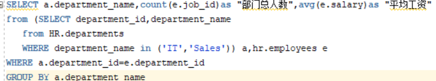

# 实验1：SQL语句的执行计划分析与优化指导
## 李飞鸿 软工4班 201810513324

### 实验目的：
#### 分析SQL执行计划，执行SQL语句的优化指导。理解分析SQL语句的执行计划的重要作用。
### 实验内容：
#### (1).对Oracle12c中的HR人力资源管理系统中的表进行查询与分析。
#### (2).首先运行和分析教材中的样例：本训练任务目的是查询两个部门('IT'和'Sales')的部门总人数和平均工资，以下两个查询的结果是一样的。但效率不相同。
#### (3).设计自己的查询语句，并作相应的分析，查询语句不能太简单。

### 教材中的查询语句：

- **查询1：**
set autotrace on
SELECT d.department_name,count(e.job_id)as "部门总人数",
avg(e.salary)as "平均工资"
from hr.departments d,hr.employees e
where d.department_id = e.department_id
and d.department_name in ('IT','Sales')
GROUP BY d.department_name;
### 运行：
### 优化指导：
### 分析：
#### 按部门的名字来分组，从hr的部门表和员工表中，部门表的部门id和员工表的部门id相等，并且部门的名字是'IT'和'Sales'。
- **查询2：**
set autotrace on
SELECT d.department_name,count(e.job_id)as "部门总人数",
avg(e.salary)as "平均工资"
FROM hr.departments d,hr.employees e
WHERE d.department_id = e.department_id
GROUP BY d.department_name
HAVING d.department_name in ('IT','Sales');
### 运行：
### 优化指导：
### 分析：
#### 按部门的名字来分组，利用HAVING来确定查询的部门名字是'IT'和'Sales',从hr的部门表和员工表中，部门表的部门id和员工表的部门id相等。
### 查询2语句要优一些。 

### 自己设计的程序语句
### 
### 运行：
### 优化指导：

### 

### 分析：
#### 按部门的名字分组，建立嵌套查询，查询部门的名字是'IT'和'Sales'的信息，再查询部门表的部门id和员工表的部门id相等的部门总人数和平均工资。
