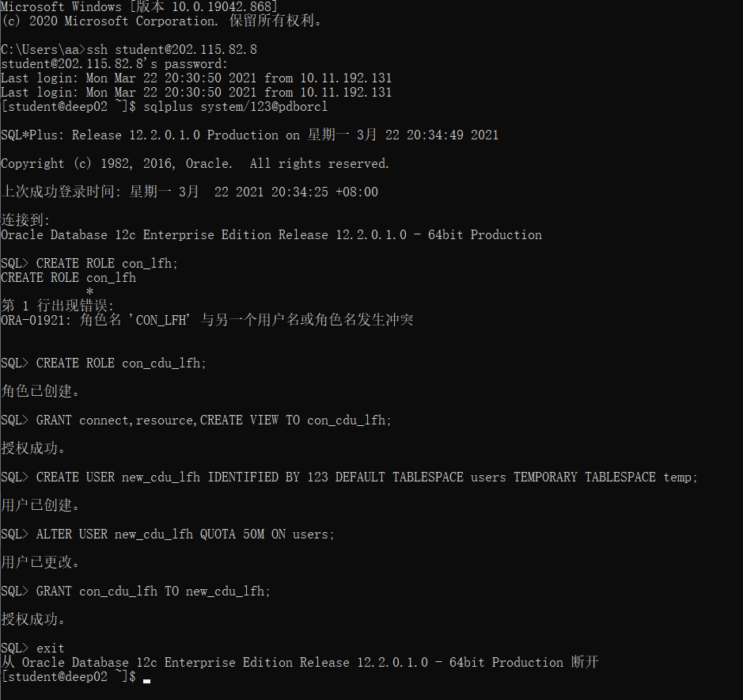
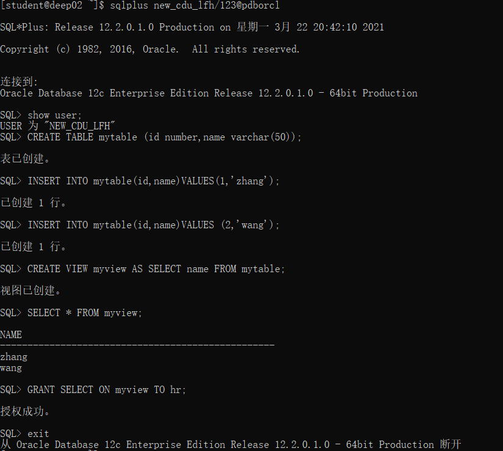
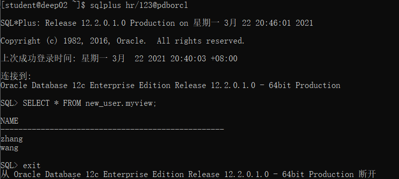

# 实验2：用户及权限管理
## 李飞鸿 软工4班 201810513324
### 实验目的：
#### 掌握用户管理、角色管理、权根维护与分配的能力，掌握用户之间共享对象的操作技能。
### 实验内容：
#### Oracle有一个开发者角色resource，可以创建表、过程、触发器等对象，但是不能创建视图。本训练要求：
- **在pdborcl插接式数据中创建一个新的本地角色con_ly，该角色包含connect和resource角色，同时也包含CREATE VIEW权限，这样任何拥有con_ly的用户就同时拥有这三种权限。**
- **创建角色之后，再创建用户new_ly，给用户分配表空间，设置限额为50M，授予con_ly角色。**
- **最后测试：用新用户new_ly连接数据库、创建表，插入数据，创建视图，查询表和视图的数据。**
### 实验步骤
- **第1步：以system登录到pdborcl，创建角色con_ly和用户new_ly，并授权和分配空间：**

语句“ALTER USER new_ly QUOTA 50M ON users;”是指授权new_ly用户访问users表空间，空间限额是50M。
- **第2步：新用户new_ly连接到pdborcl，创建表mytable和视图myview，插入数据，最后将myview的SELECT对象权限授予hr用户**

- **第3步：用户hr连接到pdborcl，查询new_ly授予它的视图myview**

### 数据库和表空间占用分析
#### 当全班同学的实验都做完之后，数据库pdborcl中包含了每个同学的角色和用户。 所有同学的用户都使用表空间users存储表的数据。 表空间中存储了很多相同名称的表mytable和视图myview，但分别属性于不同的用户，不会引起混淆。 随着用户往表中插入数据，表空间的磁盘使用量会增加。
- **查看数据库的使用情况**

- **autoextensible是显示表空间中的数据文件是否自动增加**
- **MAX_MB是指数据文件的最大容量。**

### 实验总结：

**通过本次实验，我基本掌握了用户管理、角色管理、权根维护与分配的能力，以及学习了用户之间共享对象的操作技能，实验不难，只要跟着老师的调子走，就能顺利完成。**