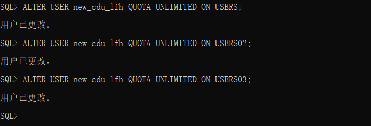

# 实验3：创建分区表

## 姓名：李飞鸿，学号：201810513324


##  实验目的

掌握分区表的创建方法，掌握各种分区方式的使用场景。

## 实验内容

* 本实验使用 3 个表空间：USERS,USERS02,USERS03。在表空间中创建两张表：订单表(orders)与订单详表(order_details)。
* 使用你自己的账号创建本实验的表，表创建在上述 3 个分区，自定义分区策略。
* 你需要使用 system 用户给你自己的账号分配上述分区的使用权限。你需要使用 system 用户给你的用户分配可以查询执行计划的权限。
* 表创建成功后，插入数据，数据能并平均分布到各个分区。每个表的数据都应该大于 1 万行，对表进行联合查询。
* 写出插入数据的语句和查询数据的语句，并分析语句的执行计划。
* 进行分区与不分区的对比实验。


## 实验步骤

1.首先创建自己的账号 new_cdu_lfh，然后以 system 身份登录: 

```sql
    ALTER USER new_cdu_lfh QUOTA UNLIMITED ON USERS;
    ALTER USER new_cdu_lfh QUOTA UNLIMITED ON USERS02;
    ALTER USER new_cdu_lfh QUOTA UNLIMITED ON USERS03;
```

 

2.用自己的账号new_cdu_lfh登录,并运行脚本文件 test3.sql: 

```sql
    cat test3.sql
```

 

```sql
    sqlplus new_cdu_lfh/123@localhost/pdborcl
    @test3.sql
```


## 查看数据库的使用情况
以下样例查看表空间的数据库文件，以及每个文件的磁盘占用情况。


## 实验总结
经过本次实验，我学习到了分区表的创建方法，通过实验以及浏览网上相关资料，基本掌握了各种分区方式的使用场景。实验不难，只要跟着老师的调子走，就能顺利完成。