**期末项目设计报告**

| 题 目    | 基于Oracle的英语订单管理系统的数据库设计 |      |              |
|----------|------------------------------------------|------|--------------|
| 课程     | Oracle数据库应用                         |      |              |
| 学 院    | 信息科学与工程学院                       |      |              |
| 专 业    | 软件工程                                 | 年级 | 2018级       |
| 学生姓名 | 李飞鸿                                   | 学号 | 201810513324 |
| 指导教师 | 赵卫东                                   | 职称 | 副教授       |

| **评分项**   | **评分标准**                 | **满分** | **得分** |
|--------------|------------------------------|----------|----------|
| 文档整体     | 文档内容详实、规范，美观大方 | 10       |          |
| 表设计       | 表，表空间设计合理，数据合理 | 20       |          |
| 用户管理     | 权限及用户分配方案设计正确   | 20       |          |
| PL/SQL设计   | 存储过程和函数设计正确       | 30       |          |
| 备份方案     | 备份方案设计正确             | 20       |          |
| **得分合计** |                              |          |          |

2021 年 6 月 1 日

# orcale数据库实验六-英语订单管理系统

*orcale数据库实验六-英语订单管理*

[*一. 概述*](#header-n4)

[*二. 需求与功能分析* ](#header-n7)

[*三. 数据库设计*](#header-n9)

[*1. 添加用户及权限管理*](#header-n10)

[*创建 LFH用户，并且给用户分配角色空间*](#header-n24)

[*2. 通过新创建的用户连接到 myorcl* ](#header-n28)

[*4. 利用新创建的用户ZLW创建了五个表*](#header-n34)

[*6. 创建视图*](#header-n138)

[*7. 将五个表的视图的SELECT对象权限授予LFH用户* ](#header-n151)

[*8. 向数据库中写入数据共计50000多个数据*](#header-n153)

[*8.1 部门表*](#header-n154)

[*8.2 员工表*](#header-n157)

[*8.3 订单详情表*](#header-n160)

[*8.4 订单表*](#header-n163)

[*8.5 产品表*](#header-n166)

[*9. PL/SQL设计*](#header-n169)

[*9.2. 包*](#header-n197)

[*9.2.1. 查询部门销售额*](#header-n198)

[*10. 数据库备份*](#header-n202)

[*热备份和冷备份优缺点*](#header-n205)

[*热备份的优点是：*](#header-n206)

[*热备份的不足是：*](#header-n212)

[*冷备份的优点是：*](#header-n216)

[*冷备份不足是：*](#header-n222)

[*物理备份之冷备份：*](#header-n227)

[*10.1. 全数据库备份*](#header-n236)

[*10.2. 查询备份文件*](#header-n241)

[*10.3. 查看备份文件的内容*](#header-n245)

[*10.4. 备份后修改数据库*](#header-n255)

[*10.5. 删除数据库文件模拟数据损坏*](#header-n259)

[*10.6. 数据库完全恢复*](#header-n268)

[*10.6.1. 重启损坏的数据库到mount状态*](#header-n269)

[*10.6.2. 开始恢复数据库*](#header-n274)

[*10.6.3. 查询数据是否恢复*](#header-n278)

[*11. DataGuard实现数据库整体的异地备份*](#header-n284)

## 一. 概述

英语订单管理系统是具有管理功能的计算机系统,而数据库原理及应用课程设计在开发应用程序中至关重要，合理的数据表结构不仅有利于软件的快速开发，而且有利于以后对软件的维护，使之能够有效的存储数据，满足各种用户的应用需求。

创建一个简单的英语订单管理系统包括英语的信息，以及学生和老师的信息。系统在oracle
的平台，上用sql语言来编写实现，此系统功能分为面向学生和面向老师两部分，其中学生可以进行查询等功能，管理员可以完成英语和学生的增加，删除和修改。

## 二. 需求与功能分析 

目的：通过专业课程设计,即大型数据库系统课程设计，有助于培养学生综合运用数据库相关知识解决实际问题的能力。本设计要求对实际问题进行需求分析，提炼实际问题中的数据，建立关系模型，并在大型数据库中得以实现。同时要求对数据库的运营、管理及使用上进行必要的规划和实现。

基本任务：

自行设计一个信息系统的数据库项目，自拟某项目名称。

设计项目涉及的表及表空间使用方案。至少5张表和5万条数据，两个表空间。

设计权限及用户分配方案。至少两类角色，两个用户。

在数据库中建立一个程序包，在包中用PL/SQL语言设计一些存储过程和函数，实现比较复杂的业务逻辑，用模拟数据进行执行计划分析。

设计自动备份方案或则手工备份方案。

设计容灾方案。使用两台主机，通过DataGuard实现数据库整体的异地备份。

设计环境：

1.  window 10 系统

2.  Oracle 数据库管理系统

## 三. 数据库设计

## 1. 添加用户及权限管理

oracle中的表就是一张存储数据的表。表空间是逻辑上的划分。方便管理的。

数据表空间 (Tablespace)

存放数据总是需要空间，
Oracle把一个数据库按功能划分若干空间来保存数据。当然数据存放在磁盘最终是以文件形式，所以一盘一个数据表空间包含一个以上的物理文件

数据表。

在仓库，我们可能有多间房子，每个房子又有多个货架，每架又有多层。
我们在数据库中存放数据，最终是数据表的单元来存储与管理的。

数据文件。

以上几个概念都是逻辑上的，
而数据文件则是物理上的。就是说，数据文件是真正“看得着的东西”，它在磁盘上以一个真实的文件体现。

创建表空间 USERS02：

~~~~~~~~~~~~~~~~~~~~~~~~~~~~~~~~~~~~~~~~~~~~~~~~~~~~~~~~~~~~~~~~~~~~~~~~~~~~~~~~

~~~~~~~~~~~~~~~~~~~~~~~~~~~~~~~~~~~~~~~~~~~~~~~~~~~~~~~~~~~~~~~~~~~~~~~~~~~~~~~~

建好tablespace, 就可以建用户

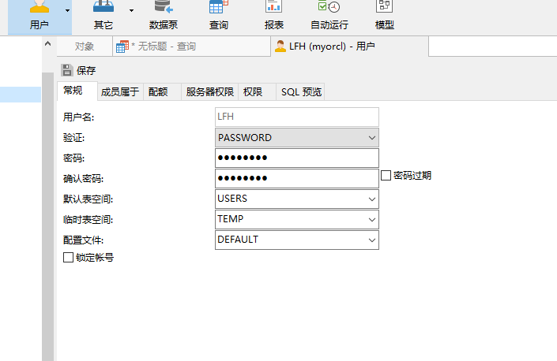

成员属于这点上 Connect和Recourse：

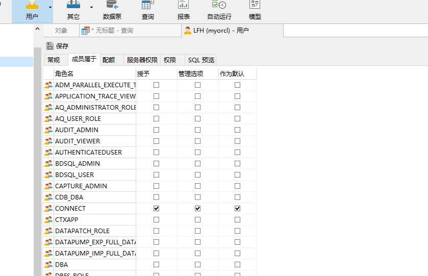

授权 create view：

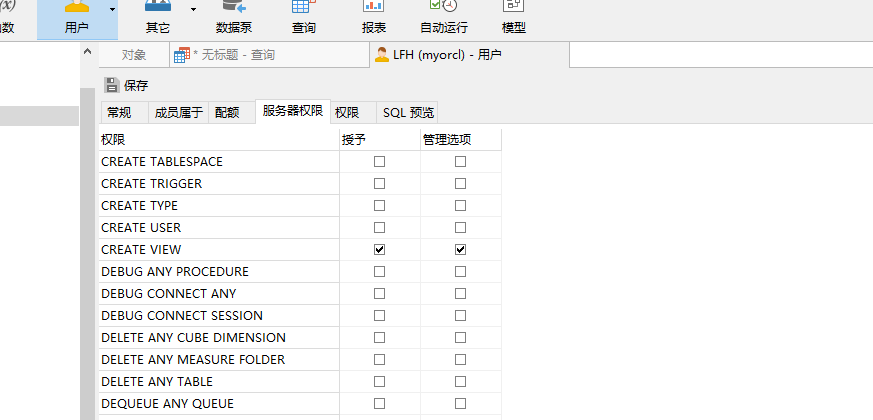

配额：

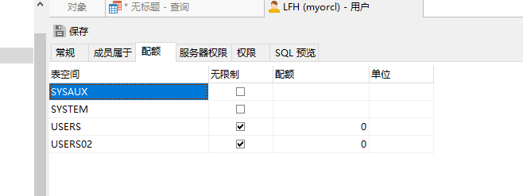

### 使用LFH用户登录本地Oracle数据库

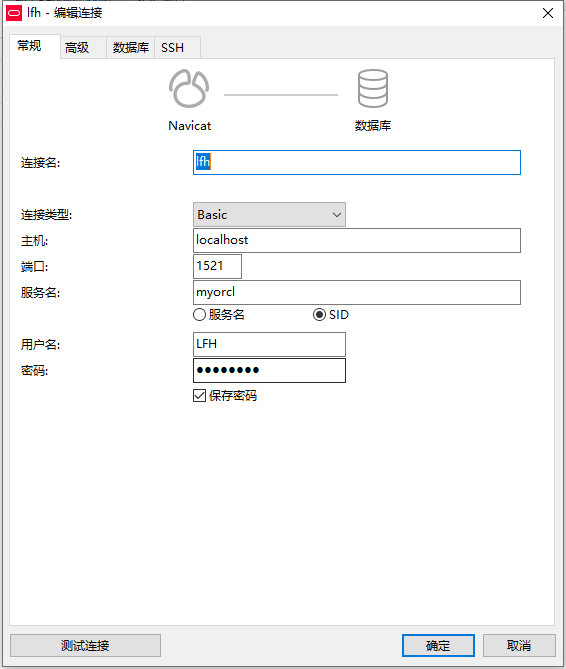

## 4. 利用新创建的用户LFH创建了五个表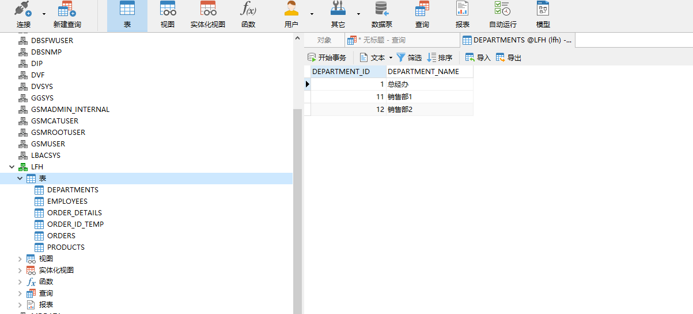

~~~~~~~~~~~~~~~~~~~~~~~~~~~~~~~~~~~~~~~~~~~~~~~~~~~~~~~~~~~~~~~~~~~~~~~~~~~~~~~~
 

部门信息表
~~~~~~~~~~~~~~~~~~~~~~~~~~~~~~~~~~~~~~~~~~~~~~~~~~~~~~~~~~~~~~~~~~~~~~~~~~~~~~~~

| 属性     | 字段            | 注解     |
|----------|-----------------|----------|
| 部门ID   | DEPARTMENT_ID   | 部门ID   |
| 部门名称 | DEPARTMENT_NAME | 部门名称 |

产品表

| 属性     | 字段         | 注解     |
|----------|--------------|----------|
| 产品编号 | PRODUCT_ID   | 产品编号 |
| 产品名称 | PRODUCT_NAME | 产品名称 |
| 产品类型 | PRODUCT_TYPE | 产品类型 |

员工表

| 属性     | 字段        | 注解     |
|----------|-------------|----------|
| 编号     | EMPLOYEE-ID | 员工ID   |
| 姓名     | NAME        | 姓名     |
| 电子邮件 | EMAIL       | 电子邮件 |
| 薪资     | SALARY      | 薪资     |
| 照片     | PHOTO       | 照片     |

订单表

| 属性                        | 字段                                                  | 注解                             |
|-----------------------------|-------------------------------------------------------|----------------------------------|
| 订单编号                    | ORDER_ID                                              | 订单编号                         |
| 日期 收款 客户姓名 客户电话 | ORDER_DATE TRAD_RECEIVABLE CUSTOMER_NAME CUSTOMER_TEL | 下单日期 收款 客户姓名 客户电话  |

订单详细表

| 属性                       | 字段                                   | 注解                           |
|----------------------------|----------------------------------------|--------------------------------|
| 编号                       | ID                                     | 编号                           |
| 编号                       | ORDER_ID                               | 订单编号                       |
| 产品名称 产品数量 产品价格 | PRODUCT_NAME PRODUCT_NUM PRODUCT_PRICE | 教师信息介绍 产品数量 产品价格 |

## 6. 创建视图

-   视图(view)，也称虚表,
    不占用物理空间，这个也是相对概念，因为视图本身的定义语句还是要存储在数据字典里的。视图只有逻辑定义。每次使用的时候,只是重新执行SQL。

-   视图是从一个或多个实际表中获得的，这些表的数据存放在数据库中。那些用于产生视图的表叫做该视图的基表。一个视图也可以从另一个视图中产生。

-   视图的定义存在数据库中，与此定义相关的数据并没有再存一份于数据库中。通过视图看到的数据存放在基表中。

-   视图看上去非常象数据库的物理表，对它的操作同任何其它的表一样。当通过视图修改数据时，实际上是在改变基表中的数据；相反地，基表数据的改变也会自动反映在由基表产生的视图中。由于逻辑上的原因，有些Oracle视图可以修改对应的基表，有些则不能（仅仅能查询）。

-   还有一种视图：物化视图（MATERIALIZED VIEW ），也称实体化视图，快照 （8i
    以前的说法） ，它是含有数据的，占用存储空间。

-   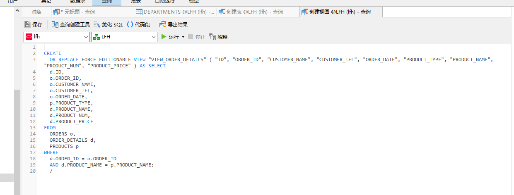

-   **CREATE**

-   **OR REPLACE FORCE EDITIONABLE VIEW "VIEW_ORDER_DETAILS" ( "ID", "ORDER_ID",
    "CUSTOMER_NAME", "CUSTOMER_TEL", "ORDER_DATE", "PRODUCT_TYPE",
    "PRODUCT_NAME", "PRODUCT_NUM", "PRODUCT_PRICE" ) AS SELECT**

-   **d.ID,**

-   **o.ORDER\_ID,**

-   **o.CUSTOMER\_NAME,**

-   **o.CUSTOMER\_TEL,**

-   **o.ORDER\_DATE,**

-   **p.PRODUCT\_TYPE,**

-   **d.PRODUCT_NAME,**

-   **d.PRODUCT_NUM,**

-   **d.PRODUCT_PRICE**

-   **FROM**

-   **ORDERS o,**

-   **ORDER_DETAILS d,**

-   **PRODUCTS p**

-   **WHERE**

-   **d.ORDER_ID = o.ORDER\_ID**

-   **AND d.PRODUCT\_NAME = p.PRODUCT_NAME;**

-   

## 8. 向数据库中写入数据共计50000多个数据

**declare**

**dt date;**

**m number(8,2);**

**V_department_ID NUMBER(6);**

**v_order_id number(10);**

**v_name VARCHAR2 ( 100 );**

**v_tel VARCHAR2 ( 100 );**

**v number(10,2);**

**begin**

**for i in 1..10000**

**loop**

**if i mod 2 =0 then**

**dt:=to_date('2015-3-2','yyyy-mm-dd')+(i mod 60);**

**else**

**dt:=to_date('2016-3-2','yyyy-mm-dd')+(i mod 60);**

**end if;**

**V_department\_ID:=CASE I MOD 3 + 1 WHEN 1 THEN 1 WHEN 2 THEN 2 ELSE 3 END;**

**--插入订单**

**v_order_id:=SEQ_ORDER_ID.nextval; --应该将SEQ_ORDER_ID.nextval保存到变量中。**

**v\_name:=**

**CASE**

**I MOD 6**

**WHEN 0 THEN**

**'zhang' \|\| i mod 100**

**WHEN 1 THEN**

**'li' \|\| i mod 100**

**WHEN 2 THEN**

**'huang' \|\| i mod 100**

**WHEN 3 THEN**

**'yi' \|\| i mod 100**

**WHEN 4 THEN**

**'ping' \|\| i mod 100 ELSE 'yin' \|\| i mod 100**

**END;**

**v\_tel := '139888883' \|\| i;**

**insert /\*+append\*/ into ORDERS (ORDER_ID, CUSTOMER_NAME, CUSTOMER_TEL,
ORDER_DATE)**

**values (v_order\_id,v\_name,v_tel,dt);**

**--插入订单y一个订单包括3个产品**

**v:=dbms_random.value(1000,800);**

**v_name:='听力'\|\| (i mod 3 + 1);**

**insert /\*+append\*/ into
ORDER_DETAILS(ID,ORDER\_ID,PRODUCT_NAME,PRODUCT_NUM,PRODUCT_PRICE)**

**values (SEQ_ORDER_DETAILS\_ID.NEXTVAL,v_order_id,v_name,1,v);**

**v:=dbms_random.value(1000,800);**

**v_name:='阅读'\|\| (i mod 3 + 1);**

**insert /\*+append\*/ into
ORDER_DETAILS(ID,ORDER\_ID,PRODUCT_NAME,PRODUCT_NUM,PRODUCT_PRICE)**

**values (SEQ_ORDER_DETAILS\_ID.NEXTVAL,v_order_id,v_name,1,v);**

**v:=dbms_random.value(1000,800);**

**v_name:='写作'\|\| (i mod 3 + 1);**

**insert /\*+append\*/ into
ORDER_DETAILS(ID,ORDER\_ID,PRODUCT_NAME,PRODUCT_NUM,PRODUCT_PRICE)**

**values (SEQ_ORDER_DETAILS\_ID.NEXTVAL,v_order_id,v_name,1,v);**

**--在触发器关闭的情况下，需要手工计算每个订单的应收金额：**

**select sum(PRODUCT_NUM\*PRODUCT_PRICE) into m from ORDER_DETAILS where
ORDER_ID=v_order_id;**

**if m is null then**

**m:=0;**

**end if;**

**UPDATE ORDERS SET TRADE_RECEIVABLE = m WHERE ORDER_ID=v_order_id;**

**IF I MOD 1000 =0 THEN**

**commit; --每次提交会加快插入数据的速度**

**END IF;**

**end loop;**

**--统计用户的所有表，所需时间很长：2千万行数据，需要1600秒，该语句可选**

**--dbms_stats.gather_schema_stats(User,estimate_percent=\>100,cascade=\> TRUE);
\--estimate_percent采样行的百分比**

**end;**

**/**

**--最后动态增加一个PARTITION_BEFORE_2018分区：**

**ALTER TABLE ORDERS**

**ADD PARTITION PARTITION_BEFORE_2018 VALUES LESS THAN (TO\_DATE(' 2018-01-01
00:00:00', 'SYYYY-MM-DD HH24:MI:SS', 'NLS_CALENDAR=GREGORIAN'));**

**ALTER INDEX ORDERS_INDEX_DATE**

**MODIFY PARTITION PARTITION_BEFORE_2018**

**NOCOMPRESS;**

代码截图：

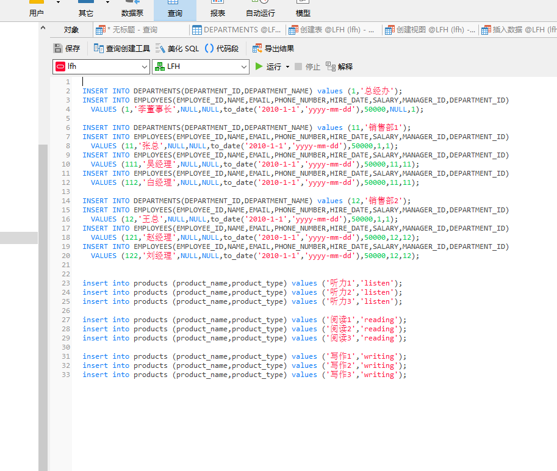

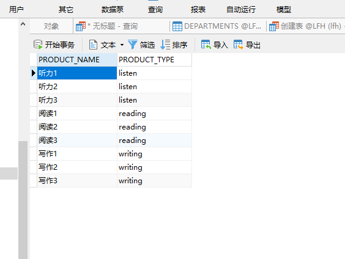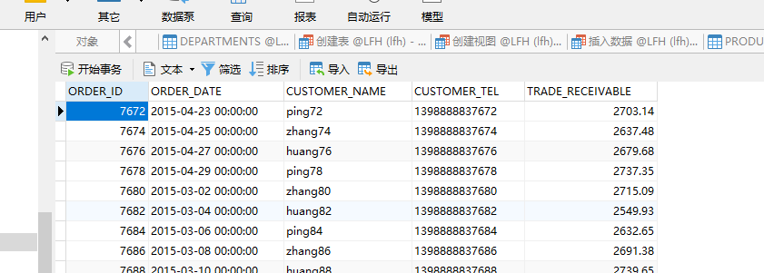

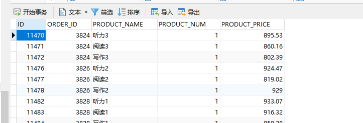

## 9. PL/SQL设计

过程和函数由以下4部分：

-   签名或头

-   关键字IS或AS

-   局部声明（可选）

-   BEGIN和END之间的过程体（包括异常处理程序）

简单示例：

~~~~~~~~~~~~~~~~~~~~~~~~~~~~~~~~~~~~~~~~~~~~~~~~~~~~~~~~~~~~~~~~~~~~~~~~~~~~~~~~
    show_line(ip_line_length  number, ip_separator  varchar2)
 
actual_line varchar2(150);

       t_user(,name,sex)(ip_line_length,ip_separator,ip_line_length);
      idx  1..ip_line_length 
         actual_line := actual_line||ip_separator;
      ;
     dbms_output.put_line(actual_line);
  others 
          dbms_output.put_line(SQLERRM);
;
~~~~~~~~~~~~~~~~~~~~~~~~~~~~~~~~~~~~~~~~~~~~~~~~~~~~~~~~~~~~~~~~~~~~~~~~~~~~~~~~

如下调用：

~~~~~~~~~~~~~~~~~~~~~~~~~~~~~~~~~~~~~~~~~~~~~~~~~~~~~~~~~~~~~~~~~~~~~~~~~~~~~~~~
    show_line(50,'=');;/
~~~~~~~~~~~~~~~~~~~~~~~~~~~~~~~~~~~~~~~~~~~~~~~~~~~~~~~~~~~~~~~~~~~~~~~~~~~~~~~~

在SQLPLUS里面调用：

~~~~~~~~~~~~~~~~~~~~~~~~~~~~~~~~~~~~~~~~~~~~~~~~~~~~~~~~~~~~~~~~~~~~~~~~~~~~~~~~
SQL> BEGIN2        show_line(50,'=');3    ;
~~~~~~~~~~~~~~~~~~~~~~~~~~~~~~~~~~~~~~~~~~~~~~~~~~~~~~~~~~~~~~~~~~~~~~~~~~~~~~~~

几点说明：

1、参数没有指定长度，当有实际数据传递进来的时候，参数的长度才被确定。

2、局部声明为：actual_line varchar2(150);

3、使用命令SQL\> show errors在SQLPLUS里面查看错误。

### 9.2. 创建函数

#### 9.2.1. 查询客户消费额

**CREATE OR REPLACE**

**PACKAGE BODY "MYPACK" AS**

**FUNCTION Get\_CustomerPayment(CUSTOMER_NAME NUMBER) RETURN NUMBER**

**AS**

**N NUMBER(20,2);
\--注意，订单ORDERS.TRADE_RECEIVABLE的类型是NUMBER(8,2),汇总之后，数据要大得多。**

**BEGIN**

**SELECT SUM(O.TRADE\_RECEIVABLE) into N FROM ORDERS O,ORDER_DETAILS E**

**WHERE O.ORDER\_ID=E.ORDER_ID AND O.CUSTOMER_NAME = CUSTOMER_NAME;**

**RETURN N;**

**END;**

**END;** 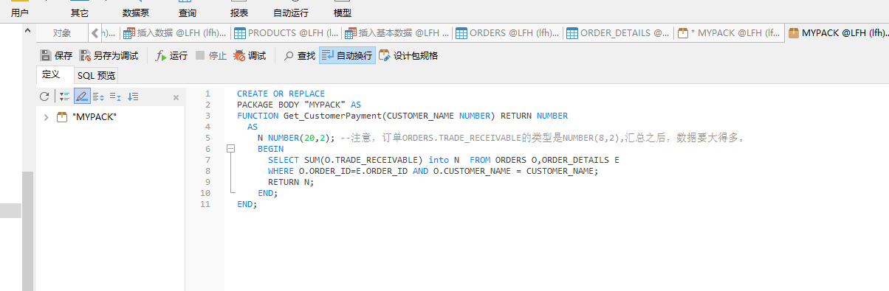

#### 9.2.2. 测试

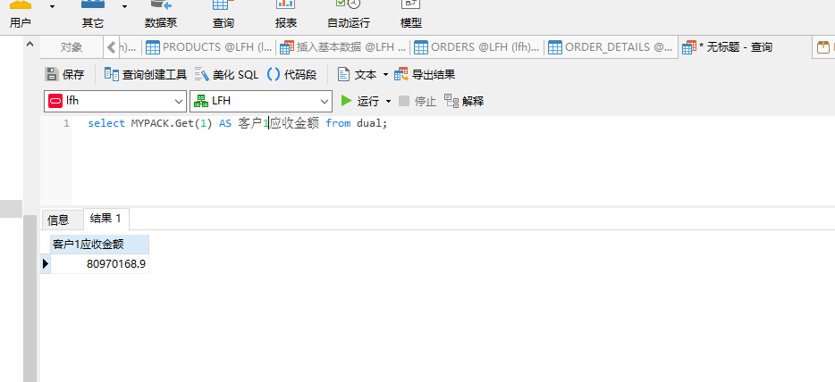

## 

## 10. 数据库备份

**ORACLE数据库备份与恢复详解**

Oracle的备份与恢复有三种标准的模式，大致分为两
大类，备份恢复(物理上的)以及导入导出(逻辑上的)，而备份恢复又可以根据数据库的工作模式分为非归档模式(Nonarchivelog-style)
和归档模式(Archivelog-style),通常，我们把非归档模式称为冷备份，而相应的把归档模式称为热备份。

### 热备份和冷备份优缺点

#### 热备份的优点是：

1．可在表空间或数据文件级备份，备份时间短。

2．备份时数据库仍可使用。

3．可达到秒级恢复（恢复到某一时间点上）。

4．可对几乎所有数据库实体作恢复。

5．恢复是快速的，在大多数情况下在数据库仍工作时恢复。

#### 热备份的不足是：

1．不能出错，否则后果严重。

2．若热备份不成功，所得结果不可用于时间点的恢复。

3．因难维护，所以要特别仔细小心，不允许“以失败而告终”。

#### 冷备份的优点是：

1．是非常快速的备份方法（只需拷贝文件）

2．容易归档（简单拷贝即可）

3．容易恢复到某个时间点上（只需将文件再拷贝回去）

4．能与归档方法相结合，作数据库“最新状态”的恢复。

5．低度维护，高度安全。

#### 冷备份不足是：

1．单独使用时，只能提供到“某一时间点上”的恢复。

2．在实施备份的全过程中，数据库必须要作备份而不能作其它工作。也就是说，数据库必须是关闭状态。

3．若磁盘空间有限，只能拷贝到磁带等其它外部存储设备上，速度会很慢。

4．不能按表或按用户恢复。

### 物理备份之冷备份：

当数据库可以暂时处于关闭状态时，我们需要将它在这一稳定时刻的数据相关文件转移到安全的区域，当数据库遭到破坏，再从安全区域将备份的数据库相关文件拷
贝回原来的位置，这样，就完成了一次快捷安全等数据转移。由于是在数据库不提供服务的关闭状态，所以称为冷备份。冷备份具有很多优良特性，比如上面图中我
们提到的，快速，方便，以及高效。一次完整的冷备份步骤应该是：

1，首先关闭数据库（shutdown normal）

2，拷贝相关文件到安全区域（利用操作系统命令拷贝数据库的所有的数据文件、日志文件、控制文件、参数文件、口令文件等（包括路径））

3，重新启动数据库（startup）

这样，我们就完成了一次冷备份，请确定你对这些相应的目录（包括写入的目标文件夹）有相应的权限。

恢复的时候，相对比较简单了，我们停掉数据库，将文件拷贝回相应位置，重启数据库就可以了，当然也可以用脚本来完成。

## 10.1. 手动数据库备份之数据库导出expdp

### 步骤：

SQL plus 已SYSTEM 用户登录

创建expdir目录并给ZLW用户授权读写

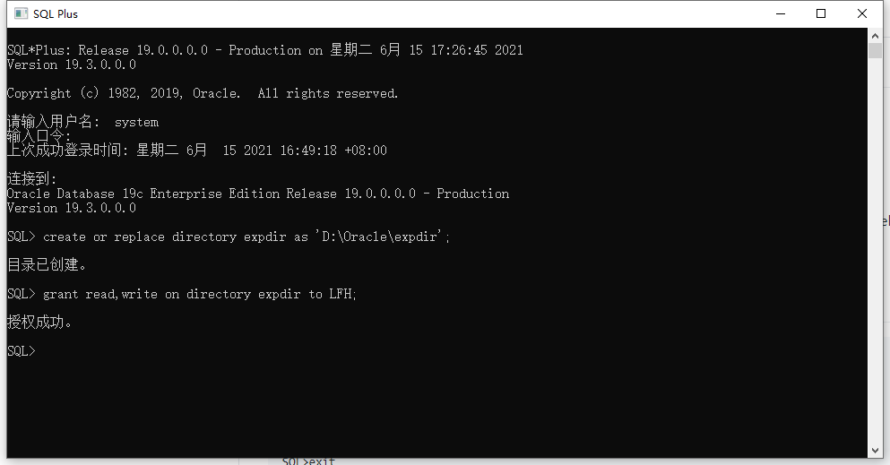

用户自己备份

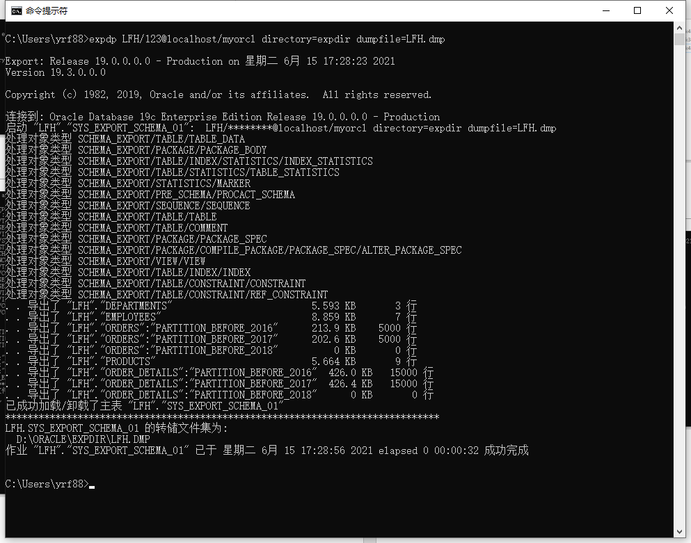

前往本地目录查看：

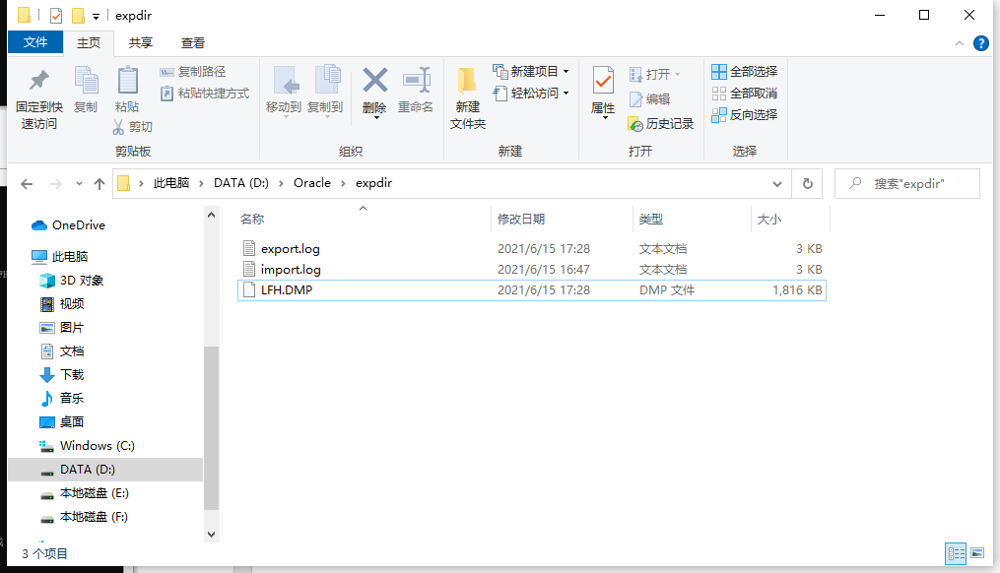

### 10.5. 删除数据库文件模拟数据损坏

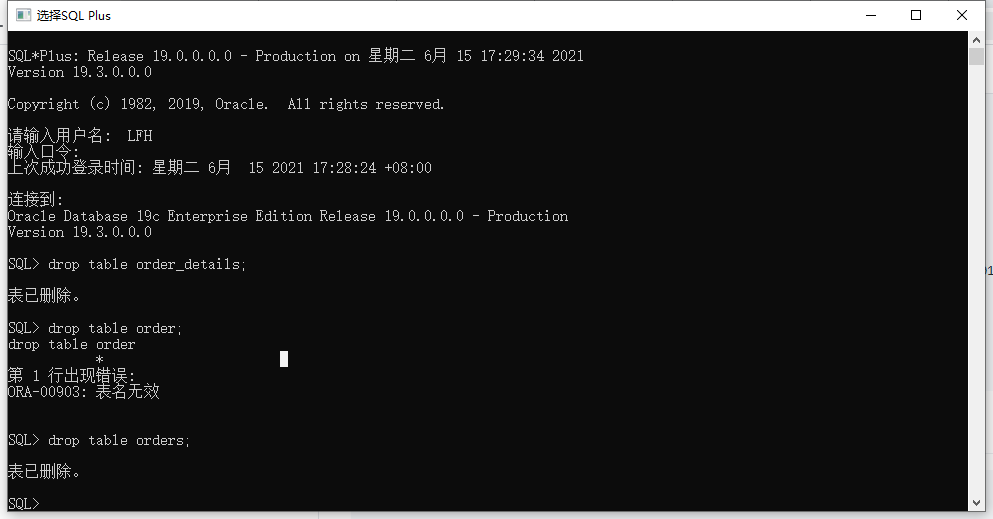

### 10.6. 数据库完全恢复

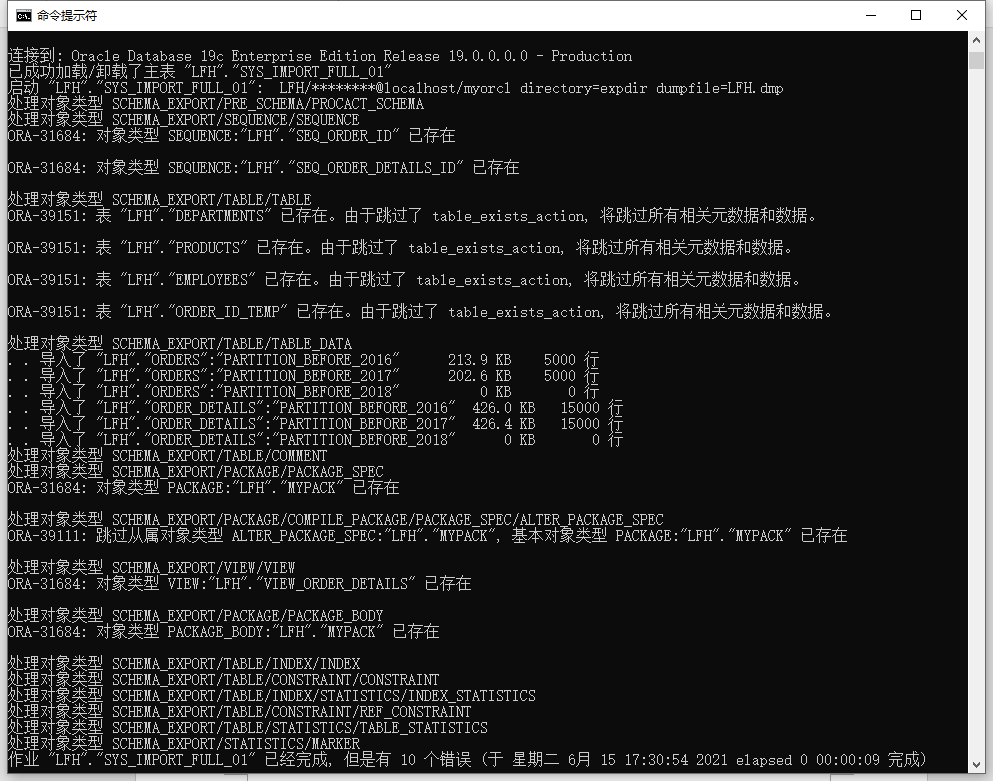

用户LFH登录数据库查看恢复情况;

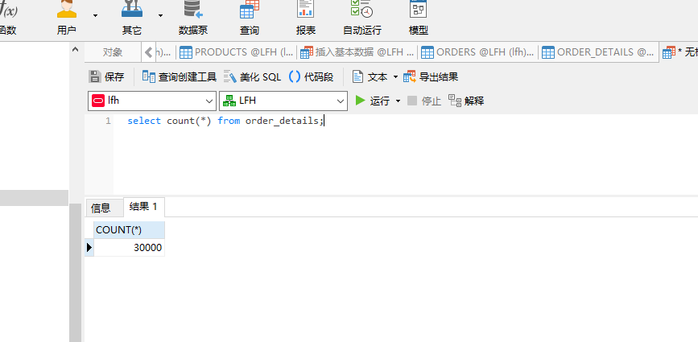

恢复成功。
